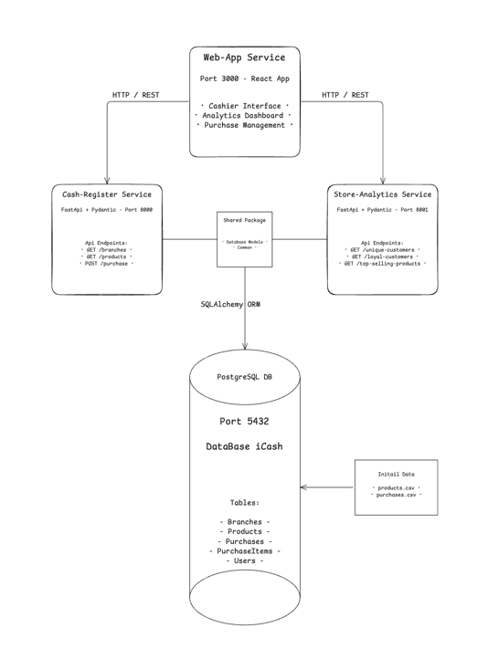
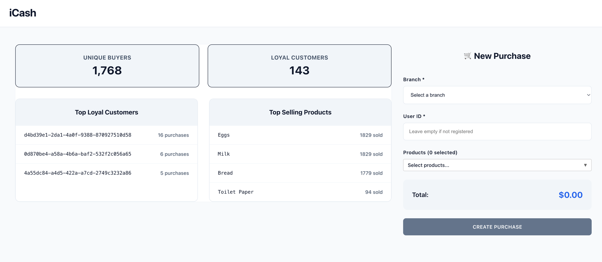

# iCash Supermarket Microservices System

A microservices-based system for managing supermarket purchases and analytics, built with Docker and FastAPI.

## Project Overview

This system implements two main microservices:

1. **Cash Register Service**
    - Simulates cashier activity
    - Handles purchase transactions
    - Stores purchase data in PostgreSQL database

2. **Store Analytics Service**
    - Provides real-time analytics
    - Tracks customer loyalty
    - Analyzes product sales


## System Architecture



Architecture Decision: Shared Database Package for Microservices

I opted for a hybrid microservices architecture where both the Cash-Register and Store-Analytics services utilize a shared database package rather than implementing separate databases per service. This architectural choice was driven by several key considerations:

**Shared Data Models & Consistency**
Both services operate on the same core business entities (Products, Branches, Purchases, Users, etc.), making a shared database package the most pragmatic approach. This ensures data consistency and eliminates the complexity of maintaining synchronized schemas across multiple databases. Any changes to the data models can be managed centrally within the shared package, reducing maintenance overhead and preventing schema drift.

**Real-Time Analytics Requirements**
The Store-Analytics service requires immediate access to transaction data as purchases occur through the Cash-Register service. By sharing the same database instance, analytics can be computed in real-time without the latency and complexity of eventual consistency patterns or event-driven synchronization that would be required with separate databases.

**Appropriate Scale Considerations**
For this application's scale and domain complexity, the benefits of strict service isolation are outweighed by the operational simplicity and data consistency guarantees of a shared database. The services remain logically separated with distinct APIs and responsibilities, while leveraging shared infrastructure for data persistence.

**Deployment Strategy**
The shared package approach also simplifies deployment orchestration, as both services can be deployed together with confidence that their data layer dependencies are aligned, while still maintaining the flexibility to scale services independently based on load patterns.

This represents a balanced approach between microservices benefits and practical implementation constraints for a retail management system of this scope.

## System Requirements

- Docker and Docker Compose
- Python 3.8+
- PostgreSQL
- Node.js (for frontend)

## Project Structure

```
.
├── web_client/          # Frontend React application
├── cash_register/       # Cash register microservice
├── store_analytics/     # Store analytics microservice
├── database/            # Database configuration and migrations
├── shared/              # Shared code and models
├── alembic/             # Database migrations
└── docker-compose.yml   # Docker configuration
```

## Setup Instructions

1. **Environment Setup**
    - Copy (or simply rename) `.env.example` to `.env` and update the configuration if needed.
    - Ensure all required environment variables are set.

2. **Database Setup**
    - The system uses PostgreSQL
    - Initial data is loaded from `Products_list.csv` and `Purchases.csv`
    - Database migrations are handled by Alembic

3. **Running the System**
   ```bash
   # Build and start all services
   docker-compose up --build
   
   # Access services:
   # Cash Register API: http://localhost:8000
   # Store Analytics API: http://localhost:8001
   # Frontend (if enabled): http://localhost:3000
   ```
   - Dashboard: http://localhost:3000/
   - Cash-Register Swagger: http://localhost:8000/docs#/
   - Store-Analytics Swagger: http://localhost:8001/docs#/

## Features

### Cash Register Service

- Simulates cashier activity
- Handles purchase transactions
- Validates purchase constraints
- Stores purchase data
- Supports UUID4 customer identification

### Store Analytics Service

- Tracks unique buyers across all branches
- Identifies loyal customers (≥3 purchases)
- Calculates top-selling products
- Provides real-time analytics

## API Documentation

### Cash Register API

- **GET /branches**
    - Get list of all branches
- **GET /products**
    - Get list of all products
- **POST /purchases**
    - Create new purchase
        - Required fields: branch_id, user_id, items

### Store Analytics API

- **GET /analytics/customers**
    - Get unique customer count
- **GET /analytics/loyal-customers**
    - Get list of loyal customers
- **GET /analytics/top-products**
    - Get top-selling products

## Data Model

## Database Schema

### Products Table

- `id`: Integer (Primary Key)
- `product_name`: String
- `unit_price`: Float

### Branches Table

- `id`: Integer (Primary Key)

### Purchases Table

- `id`: Integer (Primary Key)
- `supermarket_id`: Integer (Foreign Key to Branches)
- `user_id`: String (UUID4)
- `timestamp`: DateTime
- `total_amount`: Float

### Purchase Items Table

- `purchase_id`: Integer (Foreign Key to Purchases)
- `product_id`: Integer (Foreign Key to Products)
- `quantity`: Integer (Default: 1)
- `unit_price`: Float

### Relationships

- A Purchase belongs to a Branch
- A Purchase has many Purchase Items
- A Purchase Item belongs to a Product
- A Product can be in many Purchase Items
- A Branch can have many Purchases

### Data Model Constraints

- Each customer can buy at most one unit of each product per purchase
- Purchase total is automatically calculated from items
- All timestamps are stored in UTC
- UUID4 is used for customer identification

## Development

### Database Migrations

```bash
docker-compose exec postgres alembic upgrade head
```

### Logging

- Service logs are stored in their respective log directories
- Log levels can be configured via environment variables

### Example images
